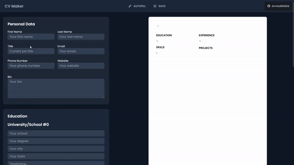

<h1 align="center">📋 CV Application</h1>

CV Maker built with React 

## Description 📝

This CV project is a web application that allows users to easily create and download their CV in a professional format. Also all changes are adopted in real-time thanks to the preveiew tab. The application is built using React and vanilla JavaScript, and utilizes libraries such as html2canvas and jsPDF for CV generation and download.

##  Live Demo 🔴

You can view a live demo by clicking <a href="https://armadillidiid.github.io/cv-application/e/">HERE</a>

## Features ✨
- User-friendly interface for creating and editing CV
- Autofill function to populate form fields
- Download CV in PDF format with high-quality images
- Real-time preview and formatting for CV content
- Support for adding and editing multiple sections in CV

## Google Lighthouse ⏱️

I gave Google Lighthouse permission to scan my application for <b>performance, accessibility, use of best practices and SEO optimization</b>. The findings are available directly below this sentence.

